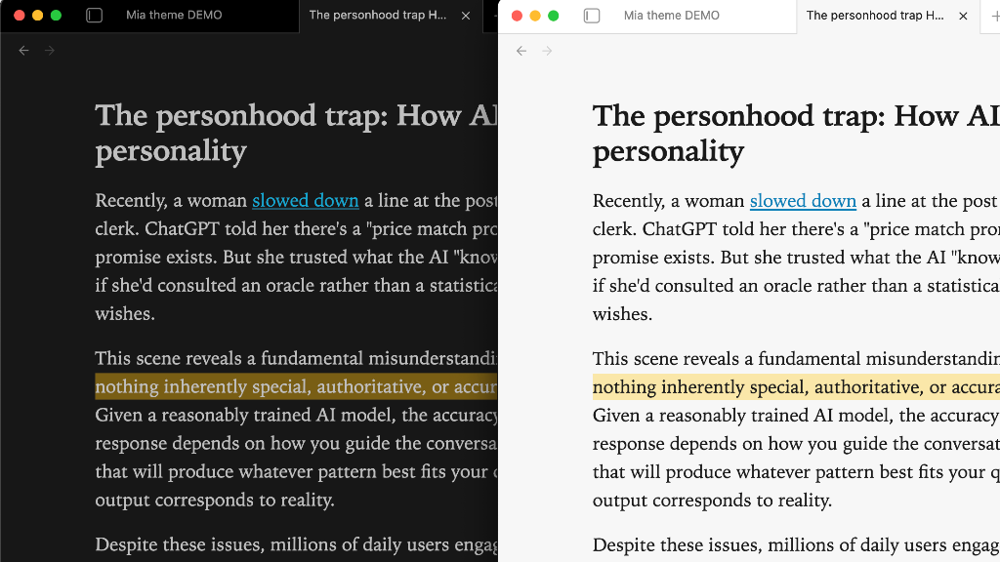

Mia is a lightweight Obsidian theme for macOS and iOS that builds on the default theme, with an emphasis on a clean, distraction-free experience.

<p align="center"></p>

## Features

- Light mode and Dark mode
- System fonts with spacing, headings, link styling designed for usability and readability[^1]
- A true Source view for working with markdown:
	- monospace font
	- headings hang in margin
	- formatting noise (e.g., url in a link) is muted
- Images are centered by default
- Image alt tags:
	- Images `float-left` and `float-right` 
	- Images `invert-dark` and `invert-light` depending on the theme
	- Constrain aspect ration to 16 / 10 with `screen`, `wallpaper`, `wp`
- Images are slightly dimmed in dark mode (configurable)
- Checkbox style for cancelled tasks `[-]`
- CSS class `reader` for reading in serif (similar to Safari reader)
- CSS class `math-left` for left-aligned math blocks
- PDF export at 12pt with black text
- Style Settings support for some of the more opinionated choices

[^1]: "SF Mono" font must be installed on desktop, otherwise default monospace font is "Menlo". See: [Fonts - Apple Developer](https://developer.apple.com/fonts/)

---

## Style settings

Install the [Style Settings](https://community.obsidian.md/plugins/obsidian-style-settings) plugin to fine-tune the Mia theme's settings.

---

## Reader view

Use `reader` in a `cssclasses` property to use a serif font for reading view.

```yaml
cssclasses: reader
```

<p align="center"></p>

---

## Image alt classes

Example:

```md
I introduced Fern to FMHY this morning.![[Blackbeard.webp|float-right|150]]
```

| alt tag               | effect                                                             |
| --------------------- | ------------------------------------------------------------------ |
| float-left            | image is left-aligned, and content wraps around it                 |
| float-right           | image is right-aligned, and content wraps around it<br>            |
| invert-dark           | image will be inverted when using the dark theme                   |
| invert-light          | image will be inverted when using the light theme                  |
| banner-top-250        | image is restricted to 250px tall, cropped to the top of the image |
| screen, wp, wallpaper | image aspect ratio is constrained to 16 / 10                       |
