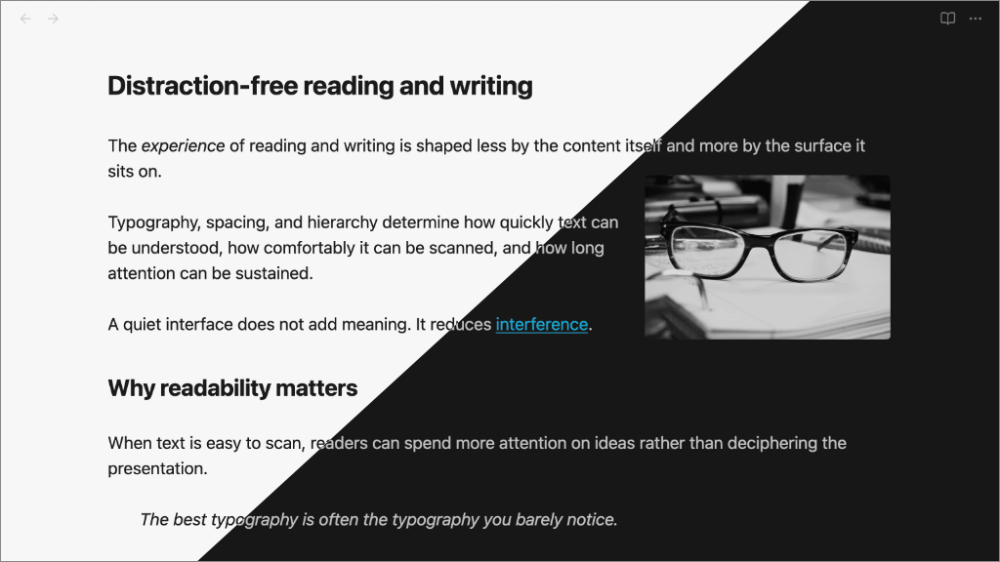
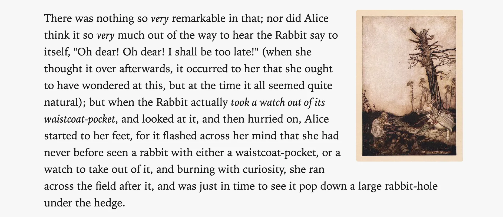
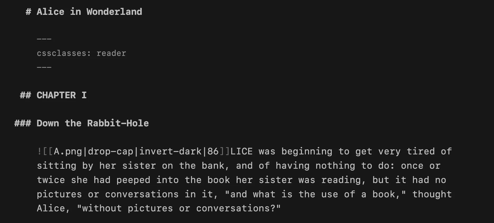
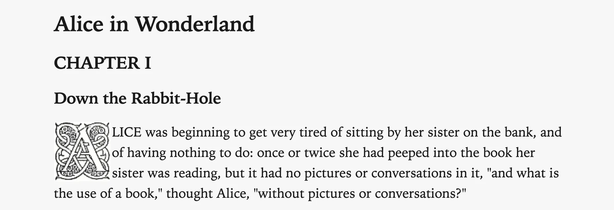
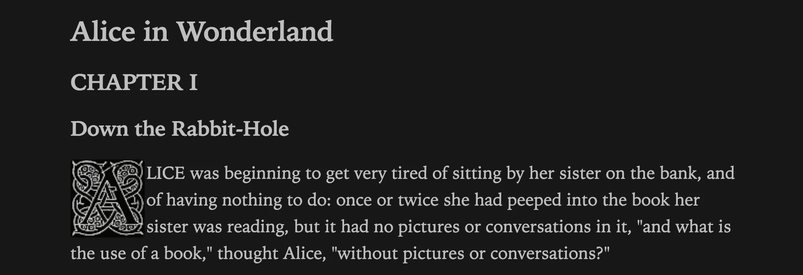

Mia is a lightweight Obsidian theme for macOS and iOS that builds on the default theme, with an emphasis on a clean, distraction-free experience.

<p align="center"></p>

## Features

- Light mode and Dark mode support
- System fonts with spacing, headings, link styling designed for usability and readability
- A true **source view** for working with markdown:
	- monospace font ("SF Mono")
	- headings hang in margin
	- formatting noise (e.g., url in a link) is muted
- Images are centered by default
- Image alt tags, including:
	- Images `float-left` and `float-right` 
	- Images `invert-dark` and `invert-light` depending on the theme
- Images are slightly dimmed in dark mode (configurable)
- Checkbox style for cancelled tasks `[-]`
- CSS class `reader` for reading in serif (similar to Safari reader)
- PDF export at 12pt with black text
- Style Settings support for some of the more opinionated choices

---

## Style settings

Install the [Style Settings](https://community.obsidian.md/plugins/obsidian-style-settings) plugin to fine-tune the Mia theme's settings.

---

## Source view

<p align="center"></p>

The source editing view is designed for working with plain text, similar to markdown editors like *iA Writer*. The monospace font "SF Mono" is used.

This font is available on iOS devices, but needs to be installed on macOS or other platforms. It is available at [Fonts - Apple Developer](https://developer.apple.com/fonts/). If you are on macOS or iOS, you do not need to install any other fonts. If you are on another platform, you may also install "SF Pro", otherwise the system-default font will be used.

You may use any other font in source view by setting the *Monospace font* in Obsidian Appearance settings.

## Reader view

<p align="center"></p>

The regular reading view uses the system font.

Use `reader` in a `cssclasses` property to use a serif font ("Iowan Old Style") for reading view.

```yaml
cssclasses: reader
```

---

## Image alt classes

| alt tag               | effect                                                                 |
| --------------------- | ---------------------------------------------------------------------- |
| float-left            | image is left-aligned, and content wraps around it                     |
| float-right           | image is right-aligned, and content wraps around it<br>                |
| drop-cap              | image is left-aligned with nominal margin, and content wraps around it |
| banner-top-250        | image is restricted to 250px tall, cropped to the top of the image     |
| screen, wp, wallpaper | image aspect ratio is constrained to 16 / 10                           |
| invert-dark           | image will be inverted when using the dark theme\*                     |
| invert-light          | image will be inverted when using the light theme\*                    |

\* these may be added *after* another alt class to combine effects.

### Example 1

```md
![[Alice and Rabbit.jpg|float-right|198]]  
There was nothing so _very_ remarkable in that; nor did Alice think it so _very_ much out of the way to hear the Rabbit say to itself, "Oh dear! Oh dear! I shall be too late!" ...
```

Output:  

<p align="center"></p>

### Example 2

Here is the source view of an example with a `drop-cap` and `invert-dark`:

<p align="center"></p>

In light mode (and reading view), the `invert-dark` has no effect:

<p align="center"></p>

In dark mode, the drop cap is inverted:

<p align="center"></p>
