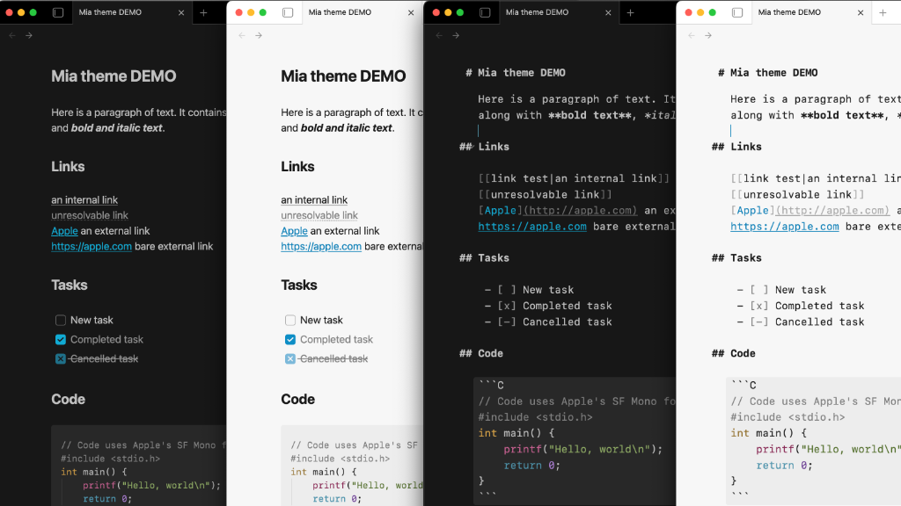
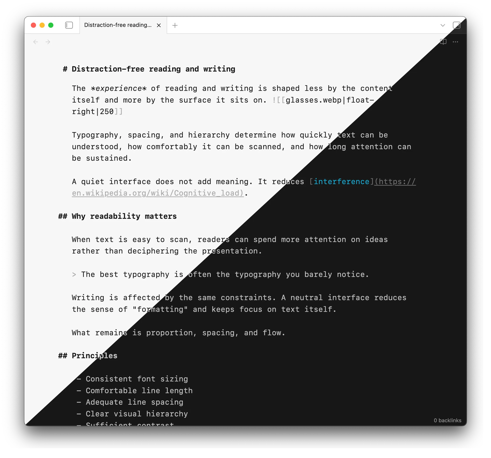
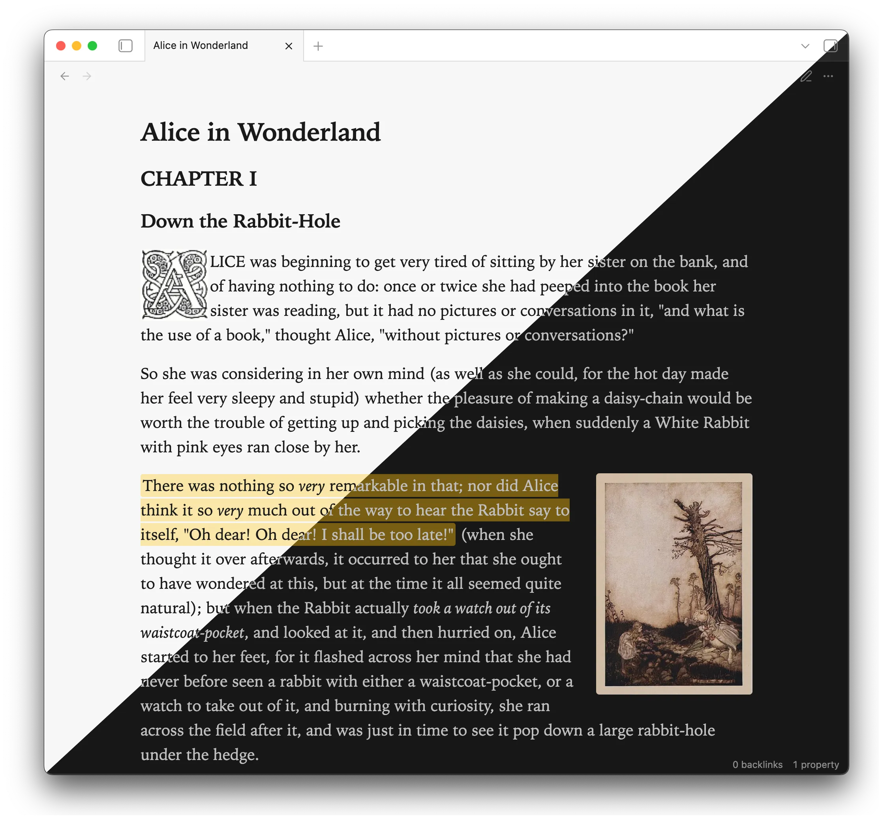
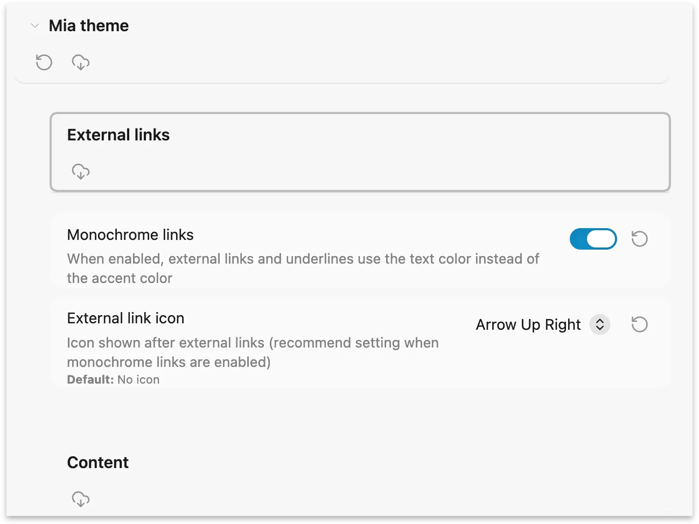
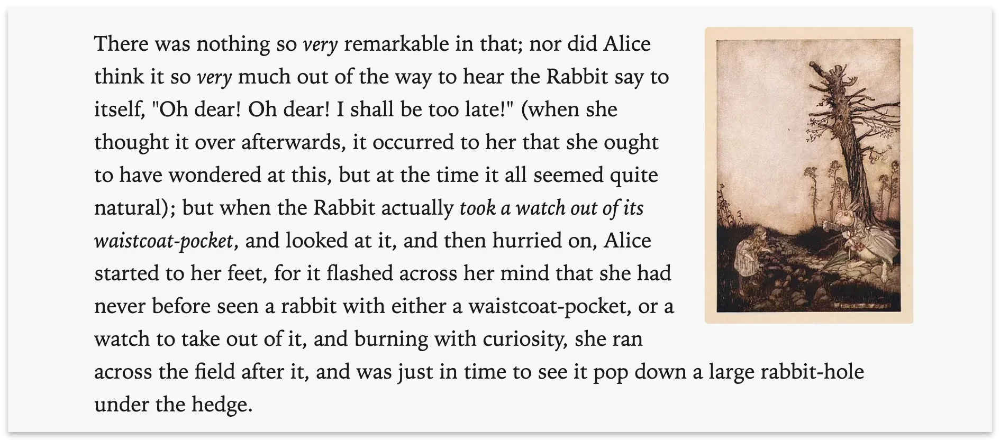
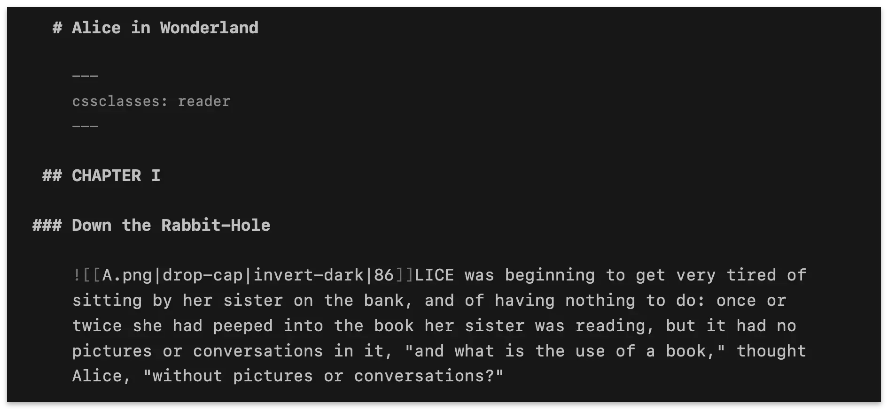
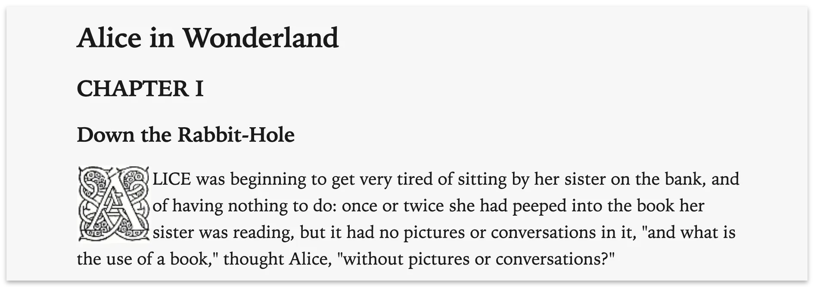
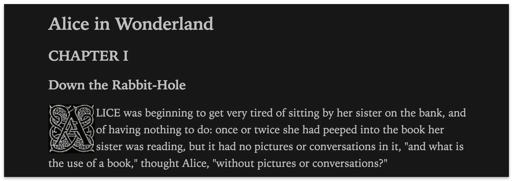

Mia is a lightweight Obsidian theme for macOS and iOS that builds on the default theme, with an emphasis on a clean, distraction-free experience.



---

## Features

- Light mode and Dark mode support
- System fonts with spacing, headings, link styling designed for usability and readability
- Monochrome external links option
- Alternative choice for external link icon, or don't show any icon
- A true **source mode view** for working with markdown:
	- monospace font ("SF Mono")
	- heading characters "#" hang in margin and
	- formatting noise (e.g., url in a link) is muted
- Embedded Bases tables are styled more like regular tables
- Single images are centered by default
- Image manipulation using alt tags:
	- Images `float-left` and `float-right` 
	- Images `invert-dark` and `invert-light` depending on the theme
	- Use `inline` to prevent an image from being centered by default
- Images are slightly dimmed in dark mode (configurable)
- Checkbox style for cancelled tasks `[-]`
- CSS class `reader` for reading in a serif font (similar to Safari reader)
- PDF export at 12pt with black text
- Fully customisable using the "Style Settings" plugin

Install Mia from the [Obsidian Theme Gallery](https://community.obsidian.md/themes/mia) page.

---

## Source mode

The source mode view is designed for working with plain text, using a monospace (or similar) font. When combined with the Obsidian setting "Readable line length", the heading characters will hang in the left margin (configurable).



By default, the monospace font "SF Mono" is used. The monospace content (code and pre-formatted text) will also use "SF Mono".

"SF Mono" is available on iOS devices, but may need to be installed on older macOS versions, and other platforms. It is available at [Fonts - Apple Developer](https://developer.apple.com/fonts/).

You may use any other font in source mode (see "Theme settings" below). Good options are the [iA Writer fonts](https://github.com/iaolo/iA-Fonts), and [Roboto Mono](https://fonts.google.com/specimen/Roboto+Mono).

If you are on macOS or iOS, you do not need to install any other fonts. If you want the theme to look the same as on macOS, install "SF Pro", and set it as the interface font in Obsidian.

---

## Reader view



The regular reading view uses the system font.

Use `reader` in a `cssclasses` property to use a serif font ("Iowan Old Style") for reading view.

```yaml
cssclasses: reader
```

You can configure Mia to always use reader view, in Style Settings. (Use `no-reader` in `cssclasses` to selectively disable this.)

---

## Theme settings

Install the [Style Settings](https://community.obsidian.md/plugins/obsidian-style-settings) plugin to fine-tune the theme settings, including enabling monochrome links, changing external link icons, and adjusting the readable line width.



Some settings may be adjusted by setting css variables in a snippet.

| Variable name                        | Description                                                                  | Default |
| ------------------------------------ | ---------------------------------------------------------------------------- | ------- |
| --mia-line-width                     | Adjust Readable line width                                                   | 800px   |
| --blockquote-border-thickness        | Blockquote border thickness                                                  | 0       |
| --checklist-done-decoration          | Completed task decoration (text is muted by default)                         | none    |
| --mia-image-muted                    | Opacity of images in dark mode                                               | 0.85    |
| --mia-font-source-override           | Font for 'Source mode' view                                                  | SF Mono |
| --mia-font-source-monospace-override | Font for monospace content (code, preformatted) in 'Source mode' view        | SF Mono |
| --mia-print-text-size                | Body text size when exporting to PDF; headings scale based on this selection | 12pt    |

---

## Image alt classes

A variety of alt-classes may be applied to an image, to arrange it on the page, control its aspect ratio, or filter it. You may specify multiple classes to combine effects; optionally specify a size (image width) at the end.

| alt tag        | effect                                                                 |
| -------------- | ---------------------------------------------------------------------- |
| float-left     | left-align image; content wraps around it                              |
| float-right    | right-align image; content wraps around it                             |
| drop-cap       | image is left-aligned with nominal margin, and content wraps around it |
| inline         | prevent image from being centered by default                           |
| banner-top-250 | restrict image to 250px tall, cropped to the top of the image          |
| screen, 16:10  | constrain aspect ratio to 16 ∶ 10                                      |
| square, 1:1    | constrain aspect ratio to 1 ∶ 1                                        |
| bw, grayscale  | render image as black and white                                        |
| sepia          | render image with a subtle sepia effect                                |
| invert-dark    | invert image colourswhen using the dark theme                          |
| invert-light   | invert image colours  when using the light theme                       |

### Example 1

```md
![[Alice and Rabbit.jpg|float-right|198]]  
There was nothing so _very_ remarkable in that; nor did Alice think it so _very_ much out of the way to hear the Rabbit say to itself, "Oh dear! Oh dear! I shall be too late!" ...
```

Output:



---

### Example 2

Here is an example with a `drop-cap` and `invert-dark`, in source mode:



In light mode (and reading view), the `invert-dark` has no effect:



In dark mode, the drop cap is inverted:



---

## Credits

- Image inversion is from contributions by **den** and **BambusControl** in this [forum post](https://forum.obsidian.md/t/auto-adaptive-images-for-dark-light-theme/13494/16). 
- Some code editor colours from [Flexoki — Steph Ango](https://stephango.com/flexoki).
- Photo used in preview image is by [Isabella Fischer](https://unsplash.com/@izzyfisch_?utm_source=unsplash&utm_medium=referral&utm_content=creditCopyText) on [Unsplash](https://unsplash.com/photos/close-up-photo-of-black-framed-eyeglasses-LXDFEdtEGUQ?utm_source=unsplash&utm_medium=referral&utm_content=creditCopyText).
- Extract from [Alice's Adventures in Wonderland by Lewis Carroll – Project Gutenberg](https://www.gutenberg.org/ebooks/28885).
